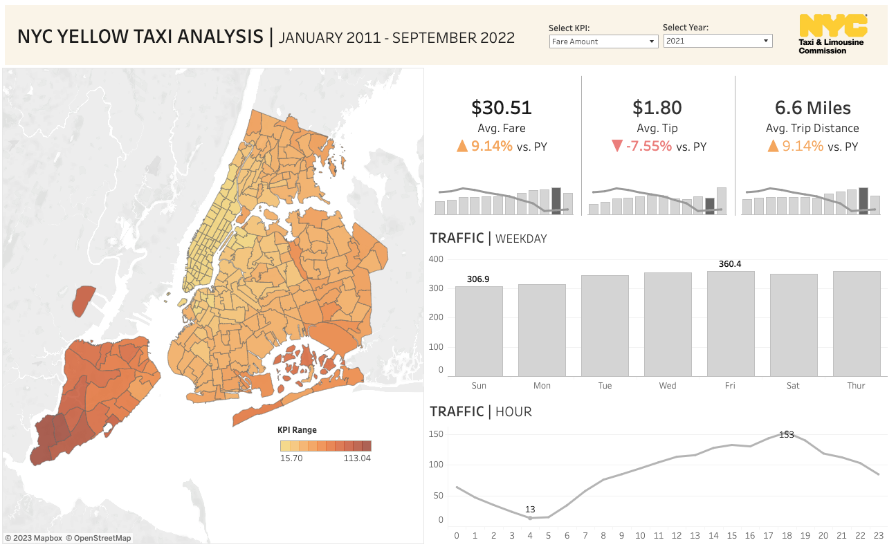

# NYC Yellow Taxi Analysis

## [NYC Yellow Taxi Analysis - Report](./preprocess.ipynb)

A yearly/hourly NYC yellow taxi analysis from 2011 to 2022 using Python / SQL (DuckDB). Each year, there are 12 parquet files. Each parquet file contains approximately 13,000,000 rows with 19 columns specified [here](https://www.nyc.gov/assets/tlc/downloads/pdf/data_dictionary_trip_records_yellow.pdf). Among the 19 columns, only `tpep_pickup_datetime`, `tpep_dropoff_datetime`, `tpep_dropoff_datetime`, `total_amount`, `tip_amount`, and `tip_amount` are used for the analysis.

## Goals

- Get the yearly/hourly trend of NYC Yellow Taxi since 2011.
- Analyze the average fare/tip amount, ride time, and distance per pick-up location id.
- Find pick-up locations that are more likely to have a higher fare amount.

## Challenge

- Imported each parquet file with about 13,000,000 rows and pre-processed it. Then, combined all of the cleaned/grouped data frames. This dramatically reduced the total number of rows without losing any essential information for the analysis. The final data frame has approximately 12,688,000 rows.

## Data Importing

- 166 parquet files in total (each file size ranges between 20MB to 400 MB)
- Created a process to automatically import only specified columns, pre-process, and group on pickup location. 
- Pick-up locations are numerically coded. Used `Taxi Zone Shapefile` which contains [spatial data](https://d37ci6vzurychx.cloudfront.net/misc/taxi_zones.zip) to convert these values properly for visualization.

## Data Cleaning

The following rows are filtered out:

1. Rides with `trip_distance` of 0.
2. Rides with `trip_time` (new column) of 0, 1, or less than 0.
3. Rides that would require a speed of more than 100 mph (computed using other columns).
4. Rides whose pick-up date time is either before 2011 or after 2022.

## Trend Analysis

Since there are too many rows for my local computer to handle, each parquet file is processed individually and grouped by pick-up location and pick-up DateTime for the analysis which results in fewer rows. For DateTime without any ride per pick-up location, zeroes are manually added for each column except the location id and pick-up DateTime.

## Visualization

[NYC Yellow Taxi Visualization](https://public.tableau.com/app/profile/junhyeok.park/viz/NYCYellowTaxiAnalysis_16733749237460/NYCTraffic).

## Reference

- [TLC Trip Record Data](https://www.nyc.gov/site/tlc/about/tlc-trip-record-data.page)