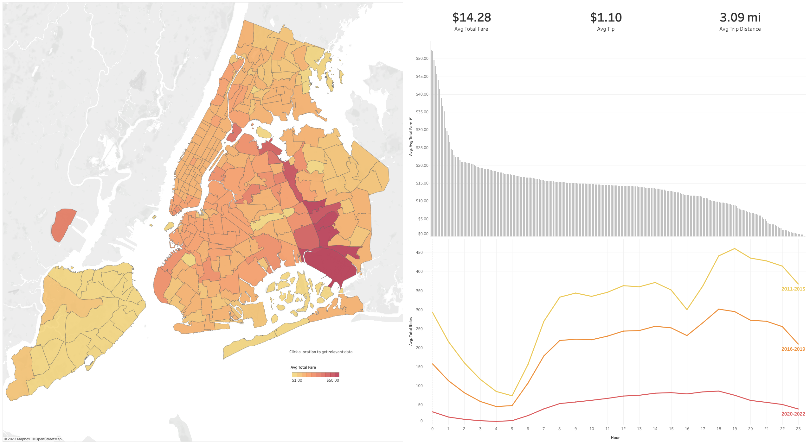

# NYC Yellow Taxi Analysis

### [Report can be found here](./preprocess.ipynb)

A yearly/hourly NYC yellow taxi analysis from 2011 to 2022. Each year, there are 12 parquet files for each month. Each parquet file contains approximately 13,000,000 rows with 19 columns specified [here](https://www.nyc.gov/assets/tlc/downloads/pdf/data_dictionary_trip_records_yellow.pdf). Among the 19 columns, only `tpep_pickup_datetime`, `tpep_dropoff_datetime`, `tpep_dropoff_datetime`, `total_amount`, `tip_amount`, and `tip_amount` will be used for the further analysis.

## [TLC Trip Record Data](https://www.nyc.gov/site/tlc/about/tlc-trip-record-data.page)

> Yellow and green taxi trip records include fields capturing pick-up and drop-off dates/times, pick-up and drop-off locations, trip distances, itemized fares, rate types, payment types, and driver-reported passenger counts. The data used in the attached datasets were collected and provided to the NYC Taxi and Limousine Commission (TLC) by technology providers authorized under the Taxicab & Livery Passenger Enhancement Programs (TPEP/LPEP). The trip data was not created by the TLC, and TLC makes no representations as to the accuracy of these data.

> For-Hire Vehicle (“FHV”) trip records include fields capturing the dispatching base license number and the pick-up date, time, and taxi zone location ID (shape file below). These records are generated from the FHV Trip Record submissions made by bases. Note: The TLC publishes base trip record data as submitted by the bases, and we cannot guarantee or confirm their accuracy or completeness. Therefore, this may not represent the total amount of trips dispatched by all TLC-licensed bases. The TLC performs routine reviews of the records and takes enforcement actions when necessary to ensure, to the extent possible, complete and accurate information.

## Goals

1. Yearly/hourly trend of NYC Yellow Taxi since 2011.
2. The average fare/tip amount, ride time, and distance per pick-up location id.
3. Which pick-up location is more likely to have a higher fare amount?

  

[DuckDB](https://duckdb.org/), a simple and fast database management system, is mainly used throughout the analysis. It works seamlessly with Pandas and allows you to directly query parquet files. Most function names come from Postgres and relational API targets Pandas compatibility. More advantages of using DuckDB are listed [here](https://alex-monahan.github.io/2021/08/22/Python_and_SQL_Better_Together.html).

## Data Importing

There are 166 parquet files in total for all yellow taxi ride records from January 2009 to September 2022 and each file size ranges between 20MB to 400 MB. Due to column specification (data before 2011 have pickup location latitude and longitude instead of location id which makes it difficult to analyze), only data since 2011 are imported for the analysis. To automatically import the parquet files, all relevant links are retrieved by request and beautifulsoup python packages. To reduce file size, only desired columns for the analysis are specified when importing data. Also, during the analysis, certain column data types are converted to more efficient types to save memory usage (int => float). 

Since pick up location is numerically coded, `Taxi Zone Shapefile` which contains [spatial data](https://d37ci6vzurychx.cloudfront.net/misc/taxi_zones.zip) is used to convert these values properly for visualization.

## Understanding the data

To understand/analyze the data more in-depth, it is crucial to know how they are recorded. First, make sure to read the data description from the [NYC TLC data dictionary](https://www.nyc.gov/assets/tlc/downloads/pdf/data_dictionary_trip_records_yellow.pdf)
and study how [taximeter works](https://www.staxi.nl/en/how-taximeters-work/#:~:text=How%20a%20taximeter%20works,taxi%20travels%20a%20certain%20distance.). There are few irregular rows and deciding what to do with them heavily depends on this domain knowledge. 

## Data Cleaning

According to [NYC TLC Data Dictionary](https://www.nyc.gov/assets/tlc/downloads/pdf/data_dictionary_trip_records_yellow.pdf), few values are manually entered by the taxi driver, and other columns are recorded by taximeters which are mainly handled by the driver. Thus, it is highly likely that each dataset involves some type of human error/irregularity. The most obvious errors are filtered out for more precise analysis. A thorough explanation of how these rows are excluded is specified [here](./preprocess.ipynb).

The following rows are filtered out:

1. Rides with `trip_distance` of 0.
2. Rides with `trip_time` (new column) of 0, 1, or less than 0.
3. Rides that would require a speed of more than 100 mph (computed using other columns).
4. Rides whose pick-up date time is either before 2011 or after 2022.

## Trend Analysis

Since there are too many rows for my local computer to handle, each parquet file is processed individually and grouped by pick-up location and pick-up DateTime for the analysis which results in fewer rows. For DateTime without any ride per pick-up location, zeroes are manually added for each column except the location id and pick-up DateTime.

## Iterating Process

Even after excluding all irrelevant data, there are still 142 parquet files to import, clean, and analyze. It is inefficient to conduct this procedure manually for each data set. With defined python functions, the whole process is applied to each data set automatically. Then all processed data sets are concatenated into a final data frame with 12,689,473 rows. After a minor cleaning process, the final data frame has approximately 12,688,000 rows. This data is then imported into the tableau for visualization.

## Visualization

An interactive visualization using Tableau. It can be found [here](https://public.tableau.com/app/profile/junhyeok.park/viz/NYCYellowTaxiAnalysis_16733749237460/NYCTraffic).

